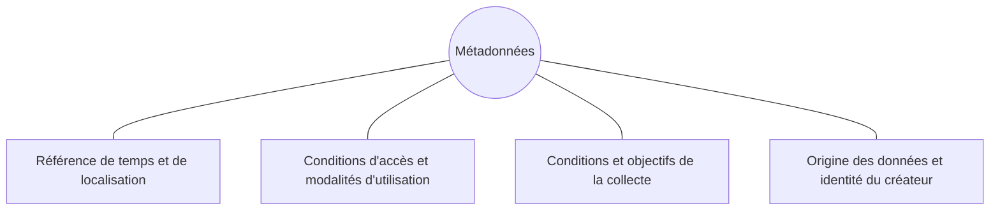

# 🏷️ Métadonnées

Une métadonnée est une donnée relative à une autre donnée. Elle permet de donner davantage de contexte aux données ou fournir des directives précises sur leur traitement.

**Intérêts** :

- Simplifier la recherche de la données
- Permettre l'ouverture des données
- Améliorer l'intéropérabilité
- Renforcer la gestion et l'archivage des données

## Simplifier le partage des données

- catalogue avec moteur de recherche
- normaliser le contenu (**ISO 19115**)
- normaliser la forme (**ISO 19139**)
- normaliser la diffusion (**CSW** : Catalog Service for the Web)

