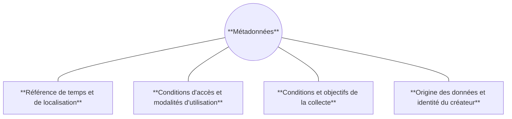

# 🏷️ Métadonnées

---
## 1. Définition

*Une métadonnée est une donnée relative à une autre donnée. Elle permet de donner davantage de contexte aux données ou fournir des directives précises sur leur traitement.*

---
**Les intérêts des métadonnées sont les suivants** :

- Simplifier la recherche de la données
- Permettre l'ouverture des données
- Améliorer l'intéropérabilité
- Renforcer la gestion et l'archivage des données
- 
---
## 2. Simplifier le partage des données

- Catalogue avec moteur de recherche
- Normaliser le contenu (**ISO 19115**)
- Normaliser la forme (**ISO 19139**)
- Normaliser la diffusion (**CSW** : Catalog Service for the Web)

---
## 3. Format DCAT

Normalisation pour le Web et pour se diriger vers un Web sémantique.

- **DCAT-AP** : Data-Catalog Vocabulary - Application Profile
- [**GeoDCAT-AP**](https://knowledge-base.inspire.ec.europa.eu/evolution/good-practice-library/geodcat-ap_en)

---
## 4. Format XML

Le format XML est utilisé pour le stockage des métadonnées, la structure de balises à respecter est définie par la norme **ISO 19139**.

---
## 5. Outils de catalogage

- GeoNetwork (diffusion d'un catalogue au format CSW)
- CKAN : Comprehensive Knowledge Archive Network
  - Très utilisé pour les portails open data