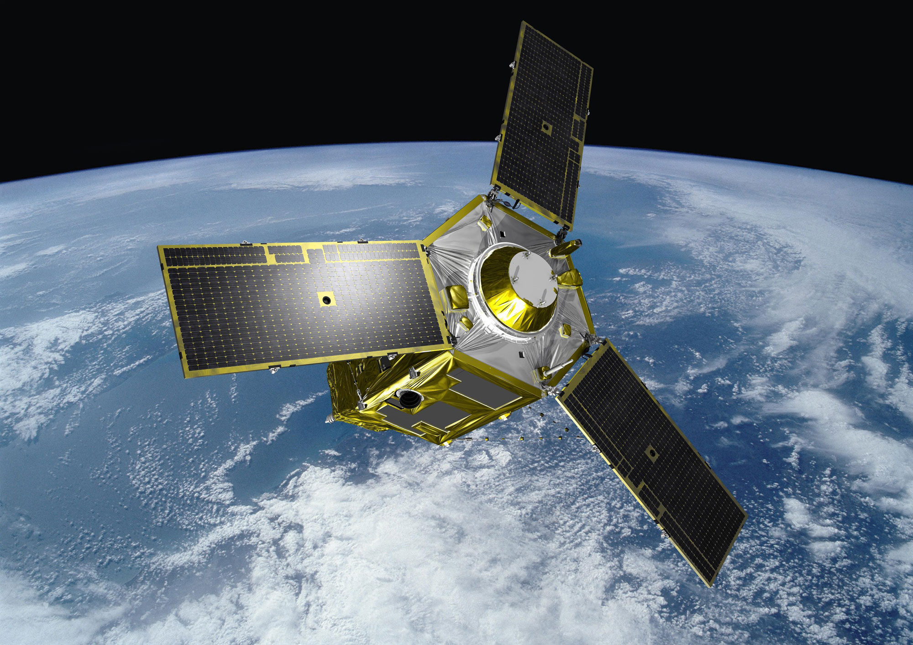

# 📍 Sources de données 

## 1. Données satellitaires                                    

### 🔭 Imagerie optique

  

  

  

 

| Constellation | Résolution | Fauchée | Capacité d'acqusition journalière
|----------|-------------|-------------|-----------------|
| **SPOT** | 1,5 m | 60 km | 3.000.000 km2 |
| **Pléiades** | 70 cm | 20 km | 700.000 km2 |
| **Pléiades Neo** | 30 cm | 14 km | 1.000.000 km2 |

### 📡 Imagerie radar (SAR)
L'imagerie radar est principalement utilisée pour la détection de mouvements de terrain ou pour permettre l'observation de la Terre quelque soit la météo. 

---
## 2. Métadonnées et catalogues

Les méta-données jouent un rôle central dans les missions du service géomatique. Elles sont la colonne vertébrale des solutions suivantes, développées en interne :

- **Catalogues de métadonnées** (ex. ISO 19115)  
- **Services OGC** (WMS, WFS, CSW)  
- **API de services géospatiaux**

Ces outils facilitent la **recherche, l’interopérabilité et la diffusion** des données satellitaires.

---

## 3. Données publiques & Open Data

Le service géomatique s’appuie régulièrement sur des sources **libres ou institutionnelles**, telles que les données OpenStreetMap (OSM) et les données de référence suivantes :

### 🗺️ Données de référence de l'IGN

- **BD TOPO®**
<html>
<head>
  <meta charset="utf-8">
  <title>BD TOPO</title>

  <!-- Leaflet CSS -->
  <link
    rel="stylesheet"
    href="https://unpkg.com/leaflet@1.9.4/dist/leaflet.css"
  />
  
</head>
<body>

<!-- Leaflet JS -->

</body>
</html>

- **BD ORTHO®** 

<html>
<head>
  <meta charset="utf-8">
  <title>BD ORTHO</title>

  <!-- Leaflet CSS -->
  <link
    rel="stylesheet"
    href="https://unpkg.com/leaflet@1.9.4/dist/leaflet.css"
  />
  
</head>
<body>

<!-- Leaflet JS -->

</body>
</html>
 

---

